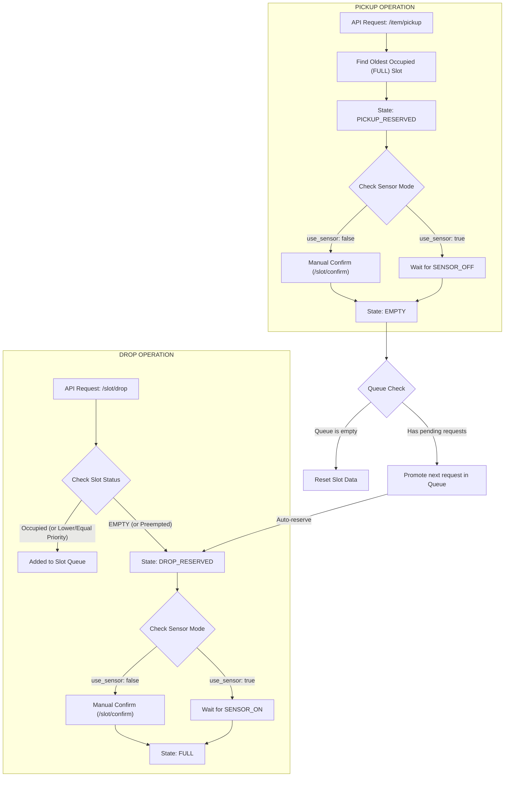

# 📦 FIFO Slot Management System

This system manages storage slot allocations, queue priorities, and drops/pickups synchronized with physical sensor states.

---

## 🚀 Overview

The Slot Management System handles inventory intake (dropping) and retrieval (pickup) operations across designated storage slots. It enforces a FIFO sequence for item pickups while managing reservations and queuing drop requests. The system operates in two sensor integration modes: an **Automated Mode** where physical sensor polling automatically triggers status updates, and a **Manual Mode** where sensor checks are disabled and transactions are verified and completed via operator confirmation.



---

## ⚙️ Slot States & Transitions

Each storage slot operates under one of four primary states:

1. **`EMPTY`**: The slot is vacant and ready for new drop requests.
2. **`DROP_RESERVED`**: A user has reserved the slot to deposit an item. The system is waiting for the slot's sensor to detect the item (`SENSOR_ON`).
3. **`FULL`**: The item is deposited in the slot, and the sensor detects it. The slot is occupied.
4. **`PICKUP_RESERVED`**: A user has requested a pickup. The slot is waiting for the sensor to detect that the item has been removed (`SENSOR_OFF`).

### Hardware Sensor Feedback Loop & Manual Confirm Mode
The system can operate in two different sensor integration modes controlled by the `"use_sensor"` configuration setting:

1. **Automated Sensor Polling Mode (`"use_sensor": true`)**:
   A background monitor thread runs every `0.2 seconds` and polls the physical sensor states mapped to the slots:
   * **Drop Confirmation**: When a slot is `DROP_RESERVED` and its corresponding sensor transitions to `true` (`SENSOR_ON`), the slot status automatically becomes `FULL`.
   * **Pickup Confirmation**: When a slot is `PICKUP_RESERVED` and its corresponding sensor transitions to `false` (`SENSOR_OFF`), the slot automatically returns to `EMPTY` (or transitions back to `DROP_RESERVED` if there is a pending user in the slot's queue).

2. **Manual Log-based Confirmation Mode (`"use_sensor": false`)**:
   In this mode, automated physical sensor checks are disabled. Operators complete reservation transactions manually by hitting the `POST /slot/confirm` endpoint (or clicking the **Confirm** button in the UI).
   * **Log Verification**: The system verifies slot actions against audit logs in `history.log` before completing the transition.

### 🚫 Disabling Sensor Polling
To disable hardware sensors and switch the system to manual log-based confirmation mode:

* **Via the Frontend UI**: Go to the **System Config Center** at the bottom of the page, uncheck the **Enable Hardware Sensors** option in the **Sensor Mode Configuration** panel, and click **SYNC CONFIG TO BACKEND**.
* **Via API Update**: Send a `POST` request to `/config/update` with `"use_sensor": false` included in the JSON payload.
* **Via config.json**: Manually edit `config.json` in the configuration directory to set `"use_sensor": false`, then restart the server.

---

## 👥 Queueing & Preemption Logic

The system includes a priority-aware queuing mechanism to manage concurrent drop requests.

### 1. User Priority
Each user is assigned a priority integer in the configuration (e.g., `ROBOT_01` has priority `1`, `human` has priority `2`).
* **Lower integer values represent HIGHER priority** (e.g., priority `1` users override priority `2` users).

### 2. The Preemption Mechanism
If a user requests to drop an item (`/slot/drop`) on a slot that is already in the `DROP_RESERVED` state:
* **Strictly Higher Priority**: If the incoming user has a higher priority (smaller number) than the user holding the reservation, the reservation is **preempted**. The incoming user secures the `DROP_RESERVED` lease, and the previous user's reservation is moved to the queue. The slot details (`reserved_for`, `reserved_item_type`, `reserved_at`, `last_drop_by`, and `items`) are updated to reflect the preempting user, and a `DROP_REQUEST` is written to the audit log.
* **Equal or Lower Priority**: The request is appended to the slot's queue.

### 3. Queue Sorting
Queue items are sorted by:
1. **User Priority** (highest priority / lowest number first)
2. **Request Time** (FIFO order - oldest request first)

---

## 🔌 API Reference

### Quick Reference Table

| Method | Endpoint | Request Body | Description |
| :--- | :--- | :--- | :--- |
| **`GET`** | `/` | *None* | Serves the Vue-based control panel user interface. |
| **`GET`** | `/slots` | *None* | Retrieves all slot configurations, active inventory states, user profiles, and configuration version. |
| **`POST`** | `/slot/suggest` | `SuggestRequest` | Queries eligible empty slots for the requested `item_type`, prioritizing direct allowance matches over wildcards. |
| **`POST`** | `/slot/drop` | `DropRequest` | Attempts to reserve the slot. Returns `RESERVED` if empty, `QUEUED` if occupied/equal priority, or `PREEMPTED` if high-priority. |
| **`POST`** | `/item/pickup` | `PickupRequest` | Dispatches a pickup request. Automatically reserves the oldest occupied slot (`FULL`) matching the item type (strict FIFO). |
| **`POST`** | `/slot/confirm` | `ConfirmRequest` | Manually confirms and completes a pending drop or pickup operation for a slot using history log checks. |
| **`POST`** | `/slot/reset` | `ResetRequest` | Resets a specific slot back to `EMPTY`, clearing items and queue. |
| **`POST`** | `/config/update/users` | `UpdateUsersPayload` | Merges new user priority and role parameters into the configuration database. |
| **`POST`** | `/config/update` | `UpdateConfigPayload` | Synchronizes and overwrites both the user and slot lists globally in memory and config.json. |
| **`GET`** | `/history` | *Query: `limit`* | Returns a chronological log of recent system state transition activities. |
| **`POST`** | `/sensor/state` | `SensorState` | Mocks/updates simulated physical hardware sensor states (`S1`-`S6`). |
| **`GET`** | `/sensor/status` | *None* | Retrieves the active simulated state of all sensors. |

### Endpoint Details

### 1. Retrieve System State
* **Endpoint**: `GET /slots`
* **Description**: Returns the configuration, slot statuses, queue information, and user list.
* **Response Example (200 OK)**:
  ```json
  {
    "slots": [
      {
        "point_name": "P-01",
        "enabled": true,
        "allowed_item": ["pallet"],
        "status": "FULL",
        "items": [
          {
            "item_type": "pallet",
            "user_id": "ROBOT_01",
            "drop_by": "ROBOT_01",
            "pickup_by": "",
            "in_time": "2026-07-07T10:38:14.501531",
            "note": "Express delivery"
          }
        ],
        "queue": []
      }
    ],
    "users": [
      {
        "user_id": "ROBOT_01",
        "priority": 1,
        "role": "ROBOT1"
      }
    ],
    "version": 4
  }
  ```

### 2. Suggest Slot
* **Endpoint**: `POST /slot/suggest`
* **Description**: Recommends the best available slots matching the requested item type.
* **Request Body**:
  ```json
  {
    "item_type": "pallet",
    "user_id": "ROBOT_01"
  }
  ```
* **Response Example (200 OK)**:
  ```json
  {
    "slots": [
      {
        "point_name": "P-01",
        "priority": 1,
        "action_type": "MATCH"
      },
      {
        "point_name": "P-04",
        "priority": 2,
        "action_type": "ANY"
      }
    ]
  }
  ```
  *(Note: `action_type: MATCH` indicates exact item eligibility; `action_type: ANY` indicates a fallback wildcard slot).*

### 3. Drop Reservation
* **Endpoint**: `POST /slot/drop`
* **Description**: Reserve a slot for drop-off. If the slot is occupied or reserved by a higher priority user, the request will be queued.
* **Request Body**:
  ```json
  {
    "point_name": "P-01",
    "item_type": "pallet",
    "user_id": "ROBOT_01",
    "note": "Express drop-off"
  }
  ```
* **Response Options**:
  * **Reserved**: `{"status": "RESERVED"}` (successful reservation or already held)
  * **Queued**: `{"status": "QUEUED"}` (the slot is occupied or reserved, request is queued)
  * **Preempted**: `{"status": "PREEMPTED"}` (preempted a lower priority reservation; the previous user is moved to the queue)

### 4. Item Pickup (Strict FIFO)
* **Endpoint**: `POST /item/pickup`
* **Description**: Initiates a pickup request. The system searches for all `FULL` slots containing the specified `item_type` and selects the **oldest** one based on `in_time`.
* **Request Body**:
  ```json
  {
    "item_type": "pallet",
    "user_id": "operator"
  }
  ```
* **Response Example (200 OK)**:
  ```json
  {
    "status": "PICKUP_RESERVED",
    "target_slot": "P-01"
  }
  ```

### 5. Manual Reset
* **Endpoint**: `POST /slot/reset`
* **Description**: Forces a slot back to an `EMPTY` state, clearing all inventory data and queue.
* **Request Body**:
  ```json
  {
    "point_name": "P-01"
  }
  ```

### 6. Sensor State Update
* **Endpoint**: `POST /sensor/state`
* **Description**: Triggers physical sensor state changes (usually called by external hardware/PLC).
* **Request Body**:
  ```json
  {
    "sensor_id": "S1",
    "detected": true
  }
  ```

### 7. Retrieve Activity History
* **Endpoint**: `GET /history`
* **Query Parameters**: `limit` (default: 100)
* **Description**: Returns a chronological log of recent system actions.

### 8. Manual Action Confirmation
* **Endpoint**: `POST /slot/confirm`
* **Description**: Confirms the pending reservation (either `DROP_RESERVED` -> `FULL` or `PICKUP_RESERVED` -> `EMPTY`/`DROP_RESERVED`) by verifying history log data, for use when hardware sensor integration is disabled.
* **Request Body**:
  ```json
  {
    "point_name": "P-01"
  }
  ```

---

## ⚙️ Configuration File

The system configuration is stored in config file and synchronized with memory:

```json
{
  "server": {
    "host": "0.0.0.0",
    "port": 8000
  },
  "users": [
    {
      "user_id": "ROBOT_01",
      "priority": 1,
      "role": "ROBOT1"
    }
  ],
  "storage": {
    "points": [
      {
        "point_name": "P-01",
        "enabled": true,
        "allowed_item": ["pallet"],
        "status": "EMPTY",
        "items": [],
        "queue": []
      }
    ]
  },
  "sensor_mapping": {
    "S1": "P-01"
  }
}
```

---

## 📖 System Manual Reader

A dedicated **Manual Reader** service is provided to serve the User Manual ([MANUAL.md](file:///home/cookies/inventory/muti_inventory/MANUAL.md)) as an interactive, styled HTML webpage.

- **Port**: `8081`
- **Primary Endpoint**: `http://localhost:8081/` (serves the operations manual page)
- **API Endpoint**: `GET /api/readme` (returns the raw Markdown contents of `MANUAL.md`)
- **Static Assets**: Serves visual aids and screenshots from the `/static` directory

---

## 🏁 How to Run
### Option 1: Run Locally (Python)

1. Activate the virtual environment:
   ```bash
   source venv/bin/activate
   ```
   *(Or install dependencies system-wide: `pip install fastapi uvicorn pydantic`)*

2. Run the Main WMS application:
   ```bash
   python muti_inventory/main.py
   ```
   * Open the control panel at `http://localhost:8000/` in your web browser.

3. Run the User Manual Reader service:
   ```bash
   python muti_inventory/manual.py
   ```
   * Open the operations manual at `http://localhost:8081/` in your web browser.

### Option 2: Run with Docker Compose

If you have Docker and Docker Compose installed:

1. Spin up both the main WMS container and the manual reader container:
   ```bash
   docker compose up --build
   ```

2. Access the applications:
   * **Main WMS System**: `http://localhost:8000/`
   * **User Manual Reader**: `http://localhost:8081/`

